# LiveChat

#### Real-time chat application developed using Firebase, Swift and SwiftUI.
MVVM Architecture, IOS 15.0, device: iphone.

## Includes ( ALL SWIFTUI )
- Combine Framework
- Firebase Auth + Database + Storage
- Custom Modifiers
- Animations
- Image picker 
- Light and Dark Mode

### Real-time chat

### Registration

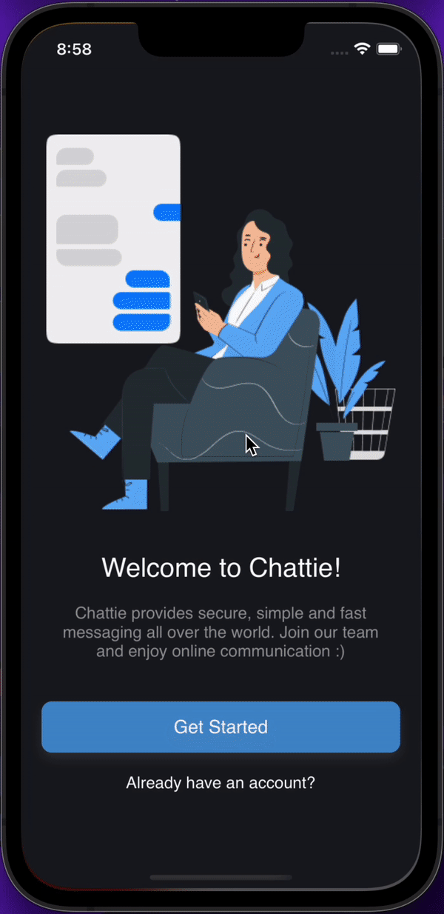

### Profile

## Screenshots 📷

### Light theme

 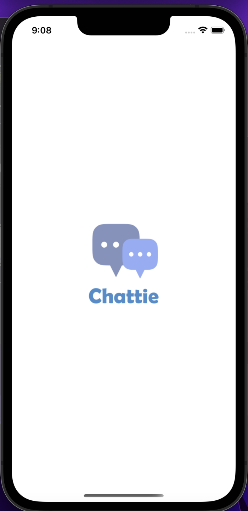
 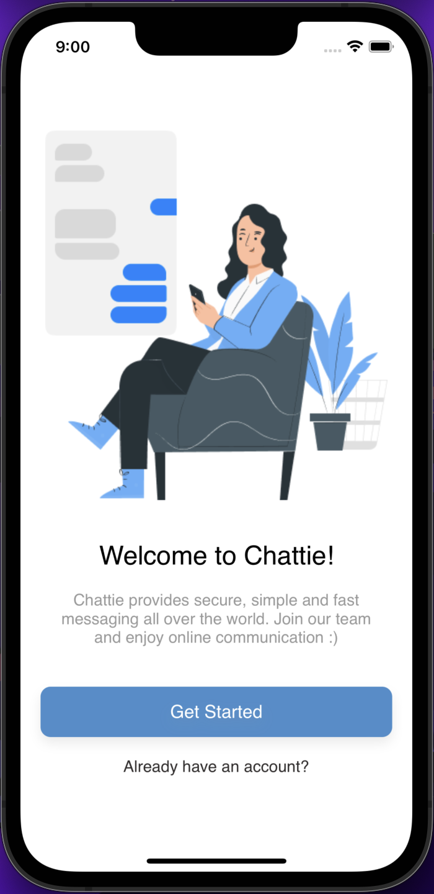
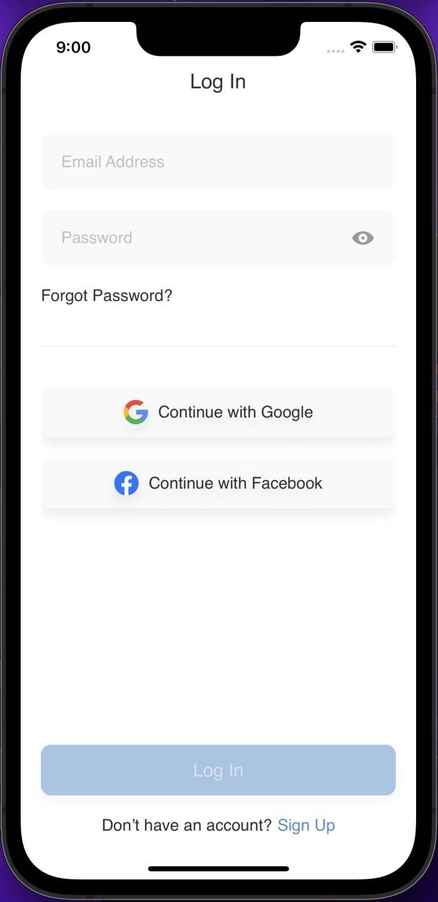
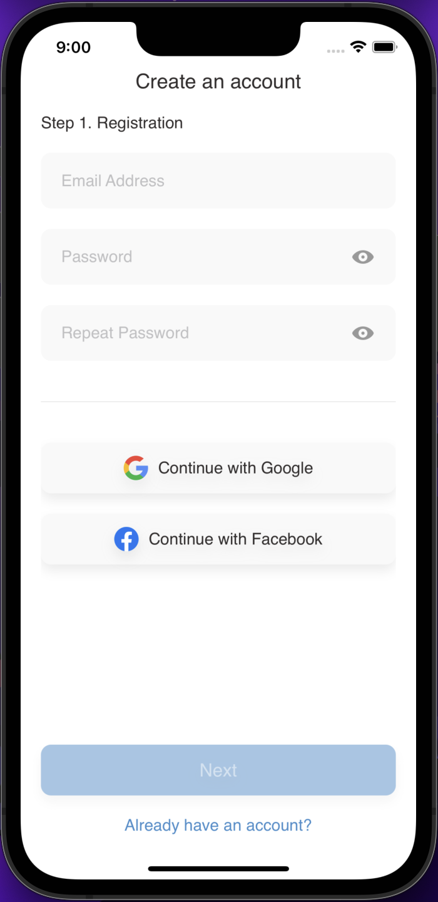
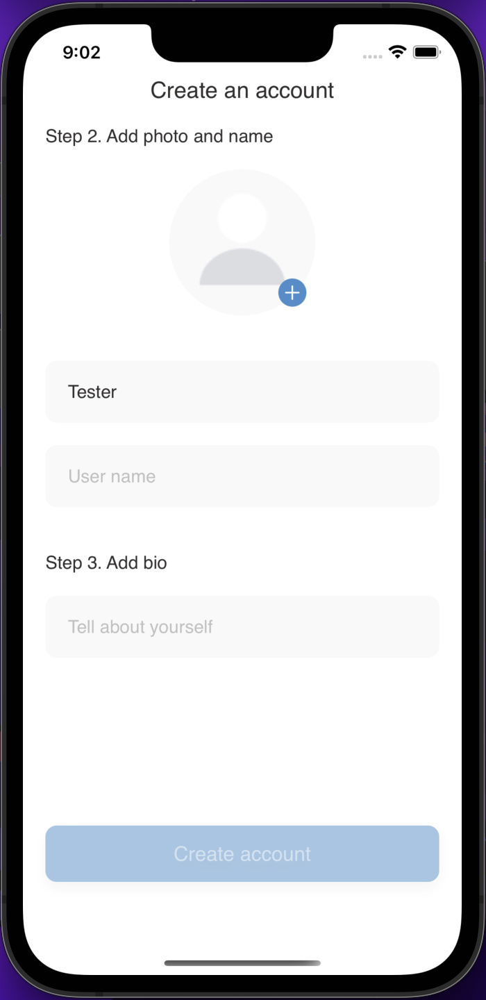
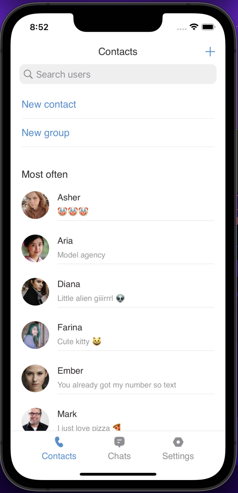
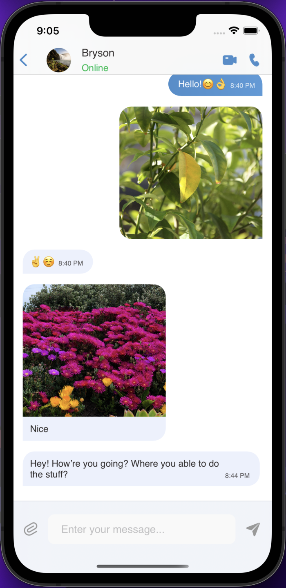

### Dark theme

  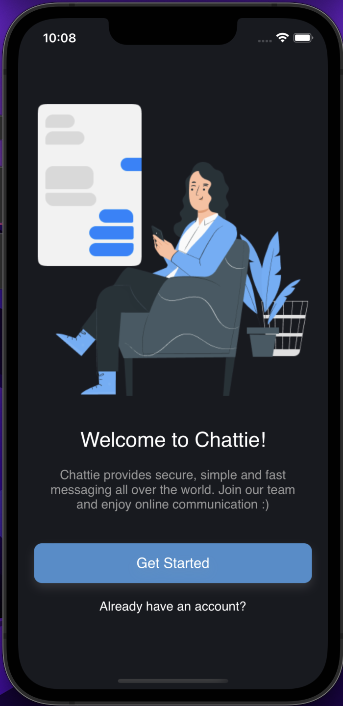
 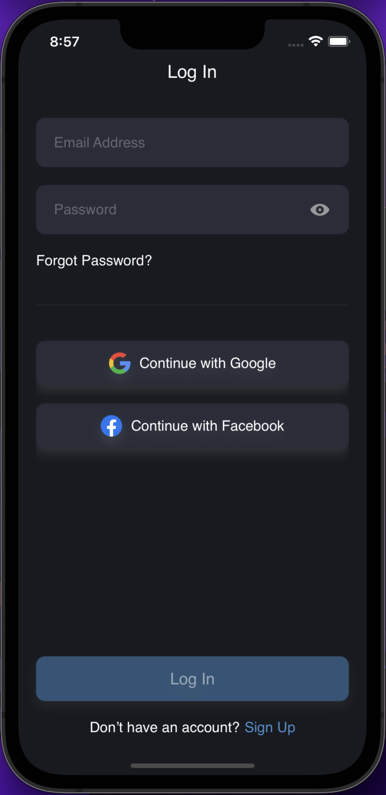
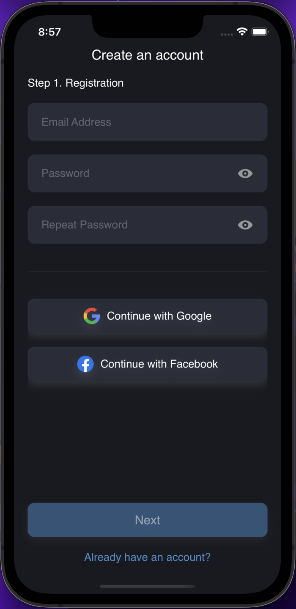
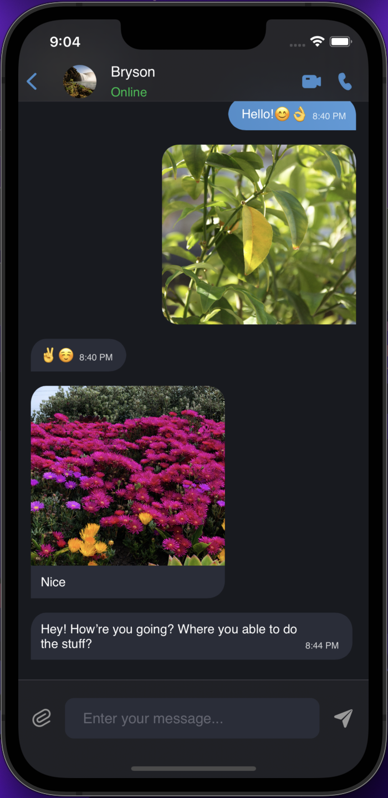
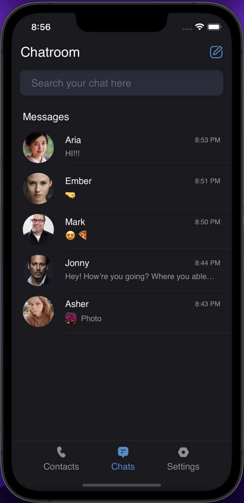
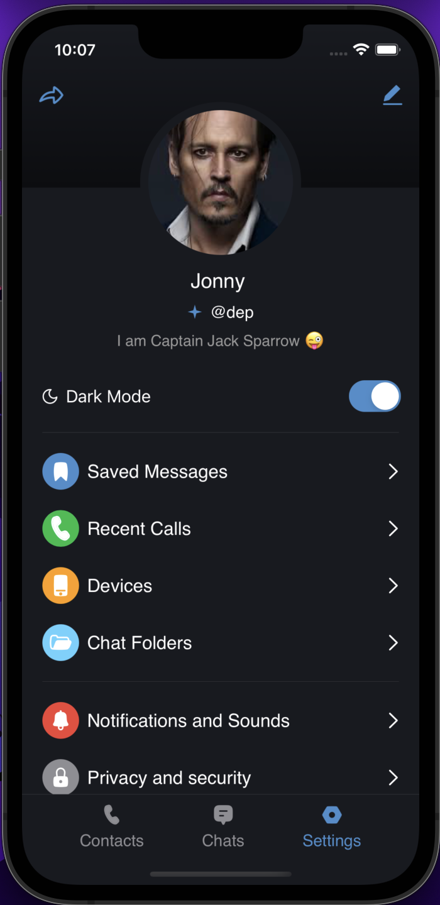

## Author
* [Bogdan Zykov](https://github.com/BogdanZyk)

## License

 Copyright 2022 Bogdan Zykov.
 Licensed under MIT License: https://opensource.org/licenses/MIT
